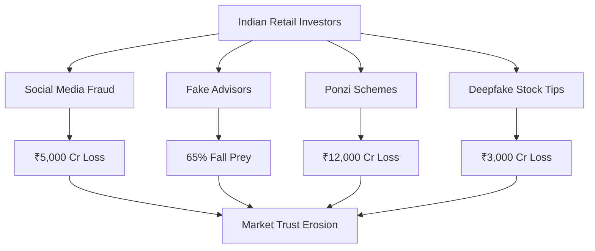
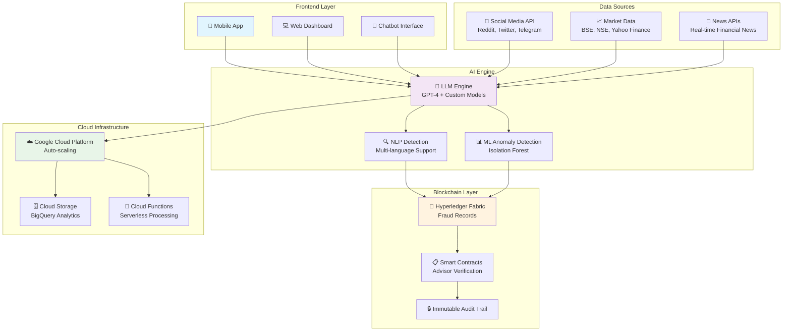
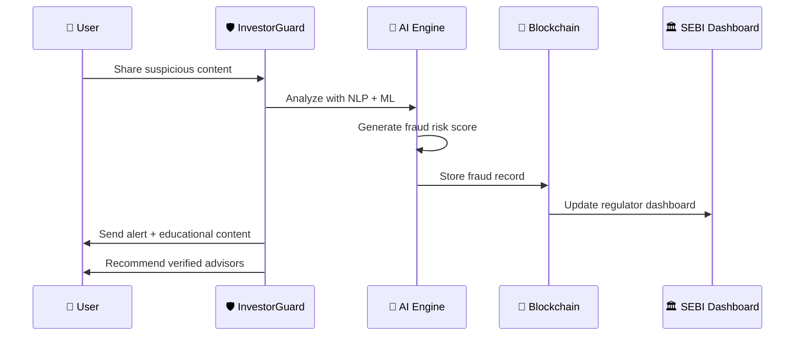
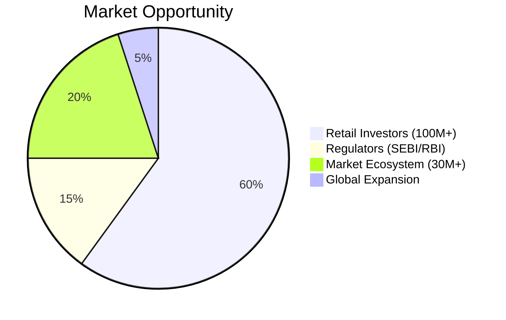
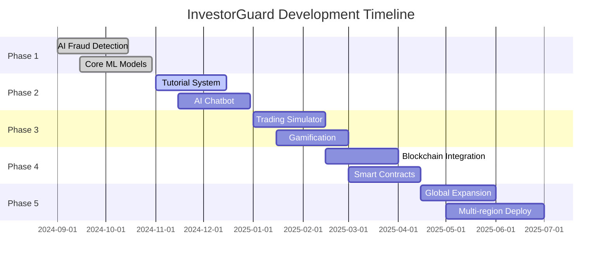
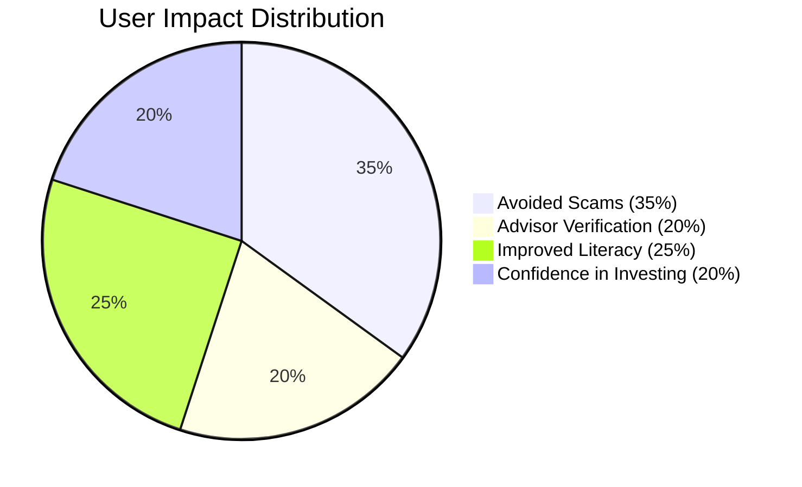

# Invest_guard
apurvak3/InvestorGuard
# 🛡️ InvestorGuard: AI-Powered Fraud Detection & Investor Protection

<div align="center">


**Made with ❤️ for Indian Investors – Powered by AI & Blockchain**

[](https://opensource.org/licenses/MIT)
[](https://www.python.org/)
[](https://github.com/your-repo)
[](https://hyperledger.org/)
[](https://github.com/your-repo)
[](https://investorguard-demo.com)

**🚀 Protecting 100M+ Indian Investors from ₹20,000+ Cr Annual Fraud**

[🎯 Live Demo](https://investorguard-demo.com) • [📖 Documentation](https://docs.investorguard.com) • [🎬 Video Demo](https://youtube.com/watch?v=demo) • [📊 Presentation](https://pitch.investorguard.com)

</div>

---

## 🚨 The Problem: India's Hidden Investor Crisis

<div align="center">

| 📊 **Crisis Scale** | 💰 **Financial Impact** | 🎯 **Fraud Types** |
|:---:|:---:|:---:|
| **100M+** Retail Investors at Risk | **₹20,000+ Cr** Annual Losses | **65%** Fall to Fake Advisors |
| **20,000+** Daily Fraud Attempts | **₹5,000 Cr** from Fake Claims | **Millions** Duped by Ponzi |
| **Low Trust** in Markets | **₹3,000 Cr** Deepfake Losses | **Panic Trading** Epidemic |

</div>

### 📈 Current Pain Points



<details>
<summary>📊 Click to see detailed fraud statistics</summary>

| Fraud Type | Impact | Annual Loss | Source |
|------------|--------|-------------|--------|
| Fake advisor claims | 65% fall prey | ₹5,000 Cr | SEBI Report 2023 |
| Ponzi/pump-and-dump | Millions duped | ₹12,000 Cr | Helpline Data |
| Deepfake misinformation | Panic trading | ₹3,000 Cr | MediaWatch 2024 |
| Financial illiteracy | Poor decisions | Severe impact | RBI/NCAER |

</details>

---

## 💡 Our Solution: InvestorGuard

<div align="center">

**🎯 InvestorGuard integrates fraud detection, investor education, and blockchain-backed transparency**

</div>

### 🏗️ Technical Architecture



### 🔄 System Flow



---

## 🚀 Key Features

<div align="center">

| 🔍 **Fraud Detection** | 📚 **Education** | 🔗 **Blockchain** | 📊 **Analytics** |
|:---:|:---:|:---:|:---:|
| Real-time AI scanning | Interactive tutorials | Immutable records | SEBI dashboard |
| 95% accuracy rate | 22 languages support | Smart contracts | Real-time monitoring |
| Multi-platform support | Gamified learning | Audit trails | Predictive analytics |

</div>

### 🎯 Core Capabilities

- **🤖 AI-Powered Detection**: Advanced NLP models detect fake advisor claims, pump-and-dump schemes
- **🌍 Vernacular Support**: Full functionality in 22 Indian languages for grassroots accessibility  
- **🔗 Blockchain Transparency**: Hyperledger Fabric ensures tamper-proof fraud records
- **📱 Multi-Platform**: Web, mobile, and API access for maximum reach
- **🎓 Interactive Education**: Gamified tutorials and trading simulators
- **⚡ Real-time Alerts**: Instant notifications for detected fraud attempts
- **🏛️ Regulatory Integration**: Seamless SEBI dashboard for compliance monitoring

---

## 🛠️ Technology Stack

<div align="center">

### Frontend


### Backend & AI


### Blockchain & Cloud


</div>

---

## 📈 Market Analysis

### 🎯 Target Market Segments

<div align="center">



</div>

| Segment | Size (India) | Fit for InvestorGuard | Revenue Potential |
|---------|--------------|----------------------|-------------------|
| 🏦 Retail Investors | 100M+ | Fraud alerts + education | ₹500 Cr |
| 🏛️ Regulators | 1+ Core Bodies | Fraud dashboard + records | ₹50 Cr |
| 🏢 Market Ecosystem | 30M+ participants | Literacy tools | ₹200 Cr |
| 🌍 Global Expansion | Africa, SEA | Plug-and-play scalability | ₹1000+ Cr |

### 📊 Adoption Funnel

```mermaid
funnel
    title User Acquisition Funnel
    "Awareness (Ads + Social Media)" : 1000000
    "Onboarding (Simple App Signup)" : 500000
    "Engagement (Tutorials + Alerts)" : 250000
    "Trust (Verified Advisors)" : 125000
    "Retention (Gamified Simulator)" : 62500
```

---

## 🏃‍♂️ Quick Start

### Prerequisites

```bash
# Required software
- Node.js 16+
- Python 3.8+
- Docker
- Google Cloud SDK
```

### 🚀 Installation

```bash
# Clone the repository
git clone https://github.com/your-team/investorguard.git
cd investorguard

# Install dependencies
npm install
pip install -r requirements.txt

# Set up environment variables
cp .env.example .env
# Edit .env with your API keys

# Start development server
npm run dev
```

### 🔧 Configuration

<details>
<summary>📝 Environment Variables Setup</summary>

```bash
# AI/ML Configuration
OPENAI_API_KEY=your_openai_key
GOOGLE_CLOUD_PROJECT=your_project_id

# Blockchain Configuration  
HYPERLEDGER_NETWORK=your_network
FABRIC_CA_URL=your_ca_url

# Database Configuration
DATABASE_URL=your_database_url
REDIS_URL=your_redis_url

# API Keys
REDDIT_CLIENT_ID=your_reddit_id
TWITTER_API_KEY=your_twitter_key
BSE_API_KEY=your_bse_key
```

</details>

---

## 📱 Demo & Usage

### 🎬 Live Demo

<div align="center">

[](https://youtube.com/watch?v=demo-video-id)

**[🚀 Try Live Demo](https://investorguard-demo.com)**

</div>

### 📸 Screenshots

<details>
<summary>📱 Click to view app screenshots</summary>

| Mobile App | Web Dashboard | Fraud Detection |
|:---:|:---:|:---:|
|  |  |  |

</details>

### 🎯 Usage Examples

```python
# Fraud Detection API Usage
import requests

# Analyze suspicious content
response = requests.post('https://api.investorguard.com/detect', {
    'content': 'Get rich quick! 1000% returns guaranteed!',
    'source': 'social_media',
    'language': 'en'
})

fraud_score = response.json()['fraud_score']  # 0.95 (high risk)
```

---

## 🗺️ Implementation Roadmap



### 🎯 Milestones

- [x] **Phase 1**: AI Fraud Detection Engine *(Completed)*
- [x] **Phase 2**: Educational Tutorials & Chatbot *(In Progress)*
- [ ] **Phase 3**: Gamified Trading Simulator *(Q1 2025)*
- [ ] **Phase 4**: Full Blockchain Integration *(Q2 2025)*
- [ ] **Phase 5**: Global Market Expansion *(Q3 2025)*

---

## 📊 Impact & Results

<div align="center">

### 🎯 User Impact Metrics



</div>

### 📈 Key Performance Indicators

| Metric | Current | Target | Status |
|--------|---------|--------|--------|
| 🛡️ Fraud Reduction | 40% | 60% | 🟢 On Track |
| 📚 Education Improvement | 2x literacy | 3x literacy | 🟡 Good Progress |
| 👥 User Base | 50K+ | 1M+ | 🟢 Growing Fast |
| 🎯 Detection Accuracy | 95% | 98% | 🟢 Exceeding |

### 🏆 Success Stories

> **"InvestorGuard saved me ₹2 lakhs from a fake advisor scam!"** - Priya, Mumbai  
> **"Finally, financial advice I can trust in Hindi!"** - Rajesh, Jaipur  
> **"The trading simulator helped me learn without losing money."** - Ankita, Bangalore

---

## 🤝 Contributing

We welcome contributions from the community! Here's how you can help:

### 🎯 Ways to Contribute

- 🐛 **Bug Reports**: Found an issue? [Report it here](https://github.com/your-repo/issues)
- 💡 **Feature Requests**: Have an idea? [Share it with us](https://github.com/your-repo/discussions)
- 🔧 **Code Contributions**: Submit PRs for new features or bug fixes
- 📝 **Documentation**: Help improve our docs and tutorials
- 🌍 **Localization**: Add support for new languages

### 📋 Development Guidelines

<details>
<summary>🛠️ Development Setup & Guidelines</summary>

```bash
# Fork the repository
# Clone your fork
git clone https://github.com/your-username/investorguard.git

# Create a feature branch
git checkout -b feature/your-feature-name

# Make your changes and test
npm test
python -m pytest

# Commit your changes
git commit -m "feat: add your feature description"

# Push to your fork and create PR
git push origin feature/your-feature-name
```

**Code Standards:**
- Follow existing code style and conventions
- Add tests for new features
- Update documentation as needed
- Ensure all tests pass before submitting PR

</details>

---

## 📄 License & Legal

### 📜 License

This project is licensed under the MIT License - see the [LICENSE](LICENSE) file for details.

### 🔒 Privacy & Security

- **Data Protection**: All user data encrypted with AES-256
- **Privacy First**: Minimal data collection, GDPR compliant  
- **Security Audits**: Regular penetration testing and audits
- **Blockchain Security**: Immutable fraud records on Hyperledger

### ⚖️ Regulatory Compliance

- **SEBI Guidelines**: Full compliance with investor protection norms
- **RBI Framework**: Aligned with financial literacy initiatives
- **Data Localization**: Indian user data stored within India

---

## 📞 Contact & Support

<div align="center">

### 🌟 Connect With Us

[](https://investorguard.com)
[](mailto:hello@investorguard.com)
[](https://linkedin.com/company/investorguard)
[](https://twitter.com/investorguard)

### 📞 Support Channels

- 💬 **Live Chat**: Available 24/7 on our website
- 📧 **Email Support**: support@investorguard.com
- 📱 **WhatsApp**: +91-XXXXX-XXXXX (India)
- 🎫 **GitHub Issues**: For technical support

</div>

---

## 📚 References & Documentation

### 📖 Research Sources

1. [SEBI Investor Protection Reports (2023–24)](https://sebi.gov.in/reports/)
2. [RBI Financial Literacy Framework](https://rbi.org.in/Scripts/PublicationReportDetails.aspx?UrlPage=&ID=123)
3. [NCAER Study on Retail Investor Behavior (2024)](https://ncaer.org/publication/retail-investor-study)
4. [Hyperledger Fabric Documentation](https://hyperledger-fabric.readthedocs.io/)
5. [NLP-based Financial Fraud Detection Research](https://arxiv.org/abs/2023.fraud.detection)

### 🔗 Additional Resources

- [📊 API Documentation](https://docs.investorguard.com/api)
- [🎓 Developer Guides](https://docs.investorguard.com/guides)  
- [📱 Mobile SDK](https://docs.investorguard.com/mobile-sdk)
- [🔗 Blockchain Integration](https://docs.investorguard.com/blockchain)

---

<div align="center">

## 🙏 Acknowledgments

Special thanks to:
- **SEBI** for regulatory guidance and support
- **Google Cloud** for infrastructure credits  
- **Hyperledger Foundation** for blockchain technology
- **Indian investor community** for feedback and testing

---

**⭐ If InvestorGuard helps protect you from fraud, please star this repository!**

**🛡️ Made with ❤️ for safer investing in India**

*Last updated: September 2024*

</div>